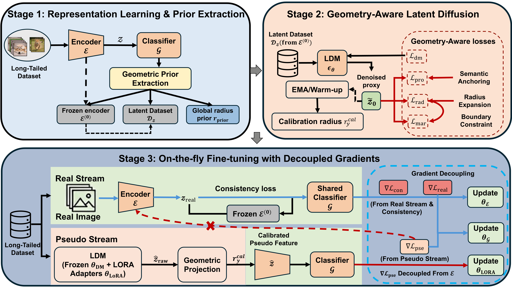

# GLAD-DC
**"GALD-DC: Geometry-Aware Latent Feature Diffusion with Distribution Calibration for Long-Tailed Image Recognition"**


## Paper and Citation  
If you find our paper/code is useful, please cite:
```
~~
```


## Framework
<p align="center">
   
</p>

**Overview of GALD-DC:**
* **Stage 1**: Train the encoder $\mathcal{E}$ and classifier $\mathcal{G}$ on long-tailed data, build the latent feature set $\mathcal{D}_z$, and extract head-class geometry statistics, including the global radius reference $r_{\text{prior}}$.
* **Stage 2**: Train a class-conditional latent feature diffusion model and apply geometry-aware losses on the denoised estimate $\tilde{z}_0$ (prototype anchoring $\mathcal{L}_{\text{pro}}$, radius constraint $\mathcal{L}_{\text{rad}}$, and boundary constraint $\mathcal{L}_{\text{mar}}$) to obtain the calibrated radius $r_y^{\text{cal}}$.
* **Stage 3**: Fine-tune with a real-image stream and an on-the-fly pseudo-feature stream; LoRA adapts the diffusion model, geometric projection enforces $r_y^{\text{cal}}$, and gradients are separated so that $\mathcal{E}$ is updated only from real/consistency losses while LoRA is updated only from pseudo-feature supervision.


## Installation
- Install `Python >= 3.8` `PyTorch >= 1.12`.
- (Optional, Recommended) Create a virtual environment as follows:

```
git clone https://github.com/oujian98-ship-it/GLAD-DC.git
cd GLAD-DC

conda create -n GLAD-DC python=3.9
conda activate GLAD-DC

# install pytorch
pip3 install torch torchvision torchaudio --index-url https://download.pytorch.org/whl/cu118

# install dependencies
pip install -r requirements.txt
```


## Usage
### Dataset
Arrange files as following:
```plain
data
    imagenet
        imagenet_lt_test.txt
        imagenet_lt_train.txt
        imagenet_lt_val.txt
        ImageNet_val_preprocess.py
        imagenet_lt_test.txt
        train
            n01440764
            ....
        val
            ILSVRC2012_val_0000000001.JPEG
            ...
    CIFAR10_LT01
        airplane
            ariplane1.png
            ...
    CIFAR10_test
        airplane
            ariplane1.png
            ...
```
